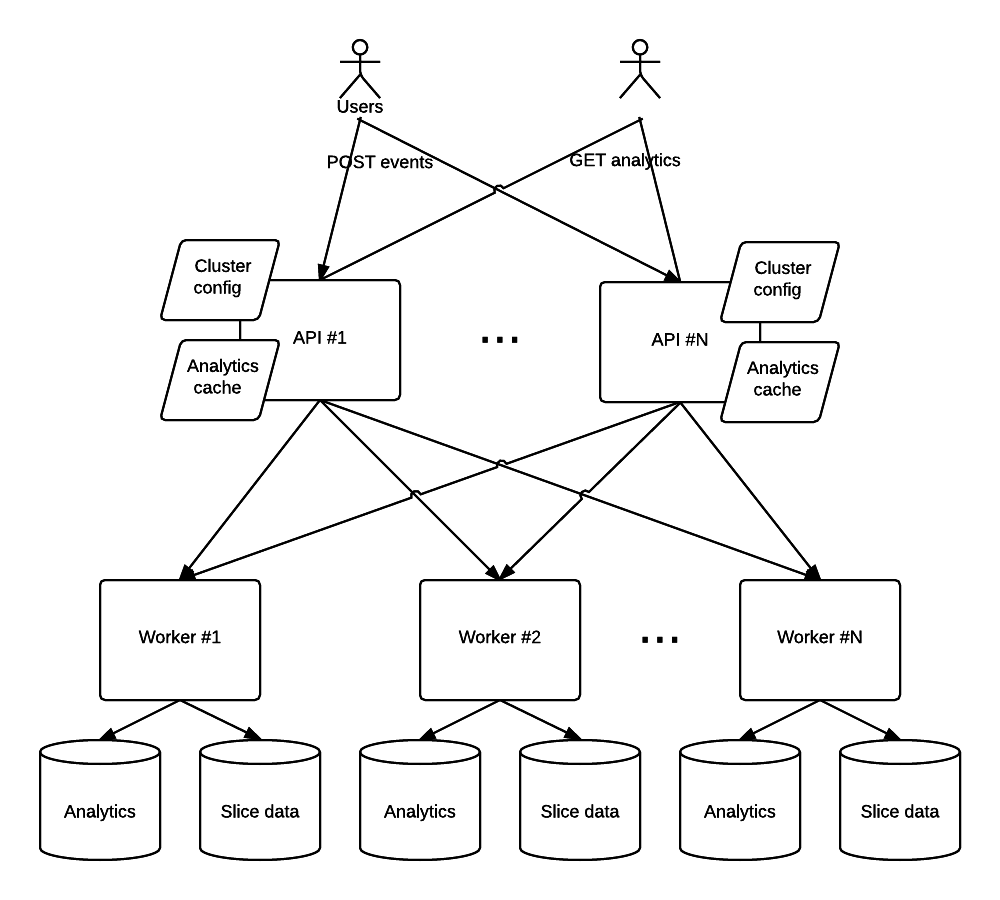

# rt

This is a solution for the problem posted [here](https://gist.github.com/jeffreyolchovy/a961dfc3570b7e9004a9df4ac6290963)

## Architecture overview



The solution consists of two types of process/nodes:

1. API nodes
2. Worker nodes

## API nodes

These implement the following external facing endpoints:
* `POST /analytics?timestamp=<ts>&user=<username>&[click|impression]`
  * This registers an event in the system. The operation returns immediately with status 202 and has no response payload.
* `GET /analytics?timestamp=<ts>`
  * This returns with status 200 and a summary of events received during the hour of the given timestamp:
```
unqiue_users,{number_of_unique_usernames}
clicks,{number_of_clicks}
impressions,{number_of_impressions}
```
* `GET /analytics/perworker?timestamp=<ts>` and  `GET /analytics/allslices?timestamp=<ts>`
  * These are similar  `GET /analytics?timestamp=<ts>`, but provide more details. Useful for testing. 

## Worker nodes

Worker nodes implement the following internal endpoints which are called by API nodes.
* `POST /worker?slice=<slice id>&user=<username>&[click|impression]`
  * This registers an event on this worker node, and updates its summary of events for the given slice. The operation then returns with status 202 and a response 
  payload describing the analytics know to this node, using the same format as the API nodes' `GET /analytics?timestamp=<ts>`
* `GET /workers?slice=<slice id>`
  * This returns with status 200 and the same payload as `POST /worker?slice=<slice id>&user=<username>&[click|impression]`

Worker nodes store and perform analytics on events. The data model is simple. Incoming data is entered in "time slices", where one slice typically coresponds to an hour. 
The API node is responsible for translating timestamps to slices. The worker keeps one key/value store per slice, and one key/value store to aggregate the number of 
users and actions in each slice.

When an event arrive, an entry for the user is inserted in the slice store, if it does not alreay exist. The aggregate store has one entry per slice, containing counters for 
users, clicks and impressions. These are updated every time an event is inserted: The user counter is increased if the user was new, and the click and impression counters are 
incremented as indicated by the event. 

The result of inserting an event is always to return the updated aggregated values for the event's slice.

## Routing

### POST Events

API nodes will route each incoming event to a single worker node. Each time slice (hour) has a set of N workers assigned to it, numbered 0,...,N-1. The event is routed by 
calculating a worker number from the username and the time slice number. I.e. all events for a given user within a time slice wil be routed to the same worker. This ensures
that the full analytics for a time slice can be calculated simply by summing the analytics known to each worker node. 

### GET analytics

Request for analytics will be routed to all worker nodes (unless there is a cache hit). The full analytics are easlily calculated by combining the response from all 
worker nodes. 

It is unfortunate that one such incoming request should generate traffic on all worker nodes. To prevent this, analytics responses from workers are cached in the API nodes.. 
The cache timeout is set to one second, but should be increased or decreased depending on the traffic volume and desired performance/corectness tradeoff. Note that the 
cache is refreshed both when fetching analytics and on very event received. In the first case responses from all worker nodes are cached. In the later the response 
from the worker node hit by the event is cached. 

## Performance and scaling.

This solution implements the stated problem with few performance bottlenecks, and should scale up easily. 

The API nodes are virtually stateless, except for caches and cluster configuration information. API nodes can be added or removed at any time. 

The routing of incoming events is cheap and deterministic, only depending on the event itself and the cluster configuration. 
With a sufficient rate of incoming events, most requests for analytics should be served directly from the API node's cache. Even 
in the case of cache misses, these shold be handled switfly, as responding to 
forwarded analytics reqeusts is a very cheap operation for the workers too.

Processing an event is a cheap operation for a worker node as well. It is simply a read and an insert into two disk-backed maps. The limiting factor here is likely to be disk IO
performance, if we wish to ensure durability of every event. Relaxing this requirement, e.g. by allowing the database files to reside in the operating system's disk cache will 
improve performance further. 

Processing analytics requests are even chaper, as ananlytics are always up to date, and almost certain to already be in memory. 

### Scaling workers

A disadvantage with the routing scheme for events, is that workes can not be added to the system quite as easily as API nodes. In essense, the set of workers used for all past and 
the current time slice cannot be changed from the moment events have been stored in the time slice, unless a scheme to redistribute data is implemented. That will in any case 
be an expensive operation. 

Adding worker nodes for a future time slice is easier. This can be done simply by adding it to the API nodes' configuration. Changes in this configuration is detected 
automatically every 30 seconds. 

Note that the system does not currently have a mechanism for keeping the cluster configuration in sync between API nodes. It is simply a file which must be kept up to 
date on each node. This could be handled by using a shared filesystem, deployment tools like [Puppet](https://github.com/puppetlabs/puppet), or a shared configuration 
storage like [Zookeeper](https://zookeeper.apache.org/) or [etcd](https://coreos.com/etcd/docs/latest/).

## Privacy

To ensure that stored data have very little value if stolen, the username on each event is replaced with a hash of the original user name and the time slice id of the event
before being forwarded to workers. This means that the datastores contain no personally identifiable information. The inclusion of the time slice id in the hash even means 
that a single user's behavior cannot be tracked across time slice boundaries. 

## Implementation details

### Network

The system uses non-blocking network IO wherever possible. All HTTP client and server code is based on the [Netty](http://netty.io/) non-blocking network library. The 
HTTP server support is provided by [Vert.x](http://vertx.io/), and HTTP client code uses [async-http-client](https://github.com/AsyncHttpClient/async-http-client).
(Vert.x especially looks like it's trying hard to be a framework, which makes the implementation a bit awkward when I'm only using it as a library for HTTP server support.)

If one wishes to go to extremes, replacing the internal communication with a custom protocol could be an option. As it is, there is probably more data being transferred in 
the form of headers than actual payloads. 

### Data storage

The current implementation uses [MapDB](http://www.mapdb.org/) to store data in files local to each worker node. This may very well be replaced by a more robust 
data store, preferrable one that provides redundant storage. [CouchDB](http://couchdb.apache.org/) or something similar comes to mind. Note that the system is 
especially designed so that each worker operate on independent subsets of data, so connecting them to one shared database cluster may not be the best idea.

### Lombok

[Lombok](https://projectlombok.org/) is a library that supports replacing lots of the boilerplate that usually comes with Java with simple annotations. Very handly, but it also means that the code will look like gibberish to your IDE unless you have the plugin installed. 

I mostly use it to initialise loggers, and generate getters, setters, hashcode/equals and builders for java beans. 

## Try it

Build with maven
```
mvn clean install
```
Note that this will run all tests, which include the integration tests in the `tests` module. You may want to hit Ctrl-c when it gets to that point as running these tests 
take ~10 minutes on my (totally underpowered) system. Most test failures are caused by data left by previous aboted test runs. Resolve this by deleting old data:
```
rm -rf ~/rt-data/*mapdb
```

A successfull build should result in the following files being built:
```
api/target/api-1.0-SNAPSHOT.jar
storage/target/worker-1.0-SNAPSHOT.jar
```

Start a test run with the `testrun.sh` script. This starts up a cluster of two API nodes and 4 storage nodes. In this configuration (`etc/cluster.json`) a time slice is set
to last for one minute, and the start time of the first slice is set to the start time of the API node process (This should really not be used with multiple API nodes, 
as they will get different start times. Replace `"first-slice" : "system"` with `"first-slice" : "<timestamp parsable by LocaDataTime#parse>"` in the cluster config.)

The test run will feed teh system with events for 5 minutes before leaving an idle cluster running. The `testrun.sh` script contains some notes on how to monitor the status 
of the cluster, either while it is feeding data or afterwards. 

If adventourous you may try changing the cluster config while it is running. Note that it will happily accept changes that break the routing for already poopulated slices, so 
be careful :) 

## Config example

```
{
/* List of api nodes. Currently only used to resolve the listen port. API node started with 0 as parameter will listen to port 8000 */
    "api-nodes" : {
        "0" : "http://localhost:8000/analytics",
        "1" : "http://localhost:8001/analytics"
    },

/* Guess! */
    "worker-nodes" : {
        "0" : "http://localhost:9000/worker",
        "1" : "http://localhost:9001/worker",
        "2" : "http://localhost:9002/worker",
        "3" : "http://localhost:9003/worker"
    },

/* How many seconds does a slice last? Typically 1 hour. */
    "length-of-time-slice" : 3600,
/* When did the first slice start? */
    "first-slice" : "2017-05-20T00:00:00",

/* Routing configuration. */
    "routing" : [ { "slice" : 0, "nodes" : ["0"] },                /* Use only worker 0 for the first hour,  */
                  { "slice" : 1, "nodes" : ["0", "1"] },                 /* then  nodes 0 and 1 for the second and third hour. */
                  { "slice" : 3, "nodes" : ["0", "1", "2", "3"] } , /*All nodes are used for the forth to the 100th hour.*/
                  { "slice" : 100, "nodes" : ["0"] } ]                 /* From the 101th hour to eternity,  only use worker 0*/
}
```


